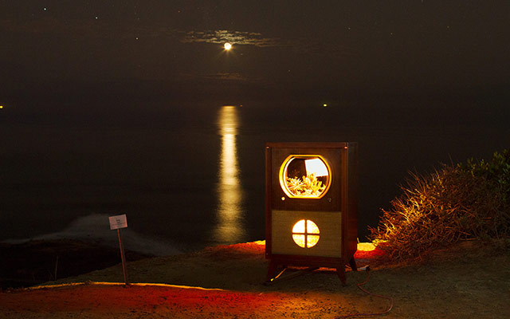
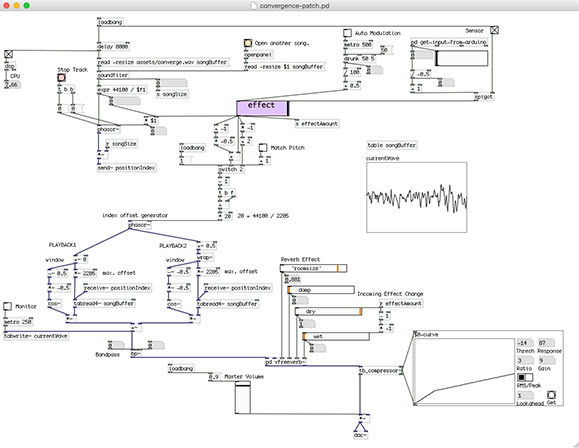

# Convergence

An interactive exhibit at the Cabrillo National Monument. The piece combined the history of the monument with the natural landscape surrounding it. An old television was modified to house arid plants in the view box, while the speaker box would play modulated surf music. The modulation would slow the music while adding echo and reverberation, mimicking the effect of erosion and wind on the land. As viewers approached the television the music would become more and more discernible.

The interaction was developed with Pure Data and a Raspberry Pi. As a person approach the piece a sonar sensor would relay their distance to the program which would modulate the audio signal in real time.

#### Pure Data Patch

## Raspberry Pi Setup

- SD card boot image: https://ccrma.stanford.edu/~eberdahl/Satellite/
- Sonar sensor setup: http://www.maxbotix.com/articles/074.htm

## Working on Mac OSX

- You can work on Pure Data on a Mac and then uploading the patch files to the Pi after.
	- https://puredata.info/downloads/pd-extended
	- use `scp` to copy files to and from your Pi ([link](https://ccrma.stanford.edu/wiki/Satellite_CCRMA_First_Steps))

## Pure Data references

- https://www.youtube.com/playlist?list=PL12DC9A161D8DC5DC
- http://en.flossmanuals.net/pure-data/dataflow-tutorials/arrays-graphs-tables/
